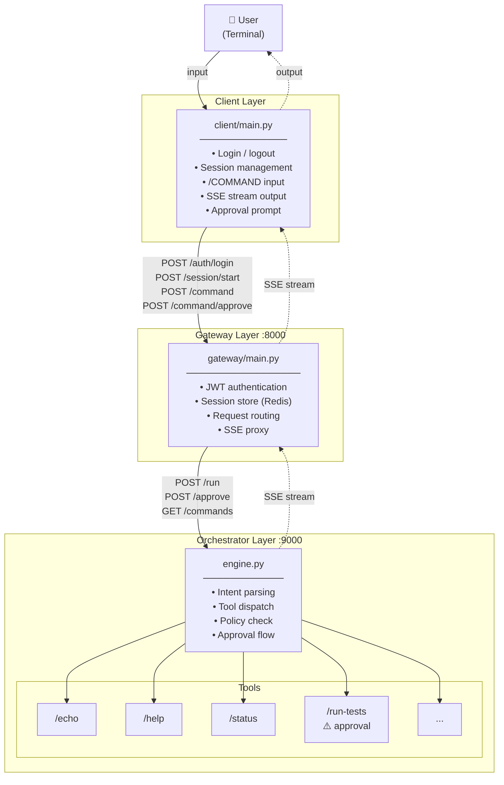
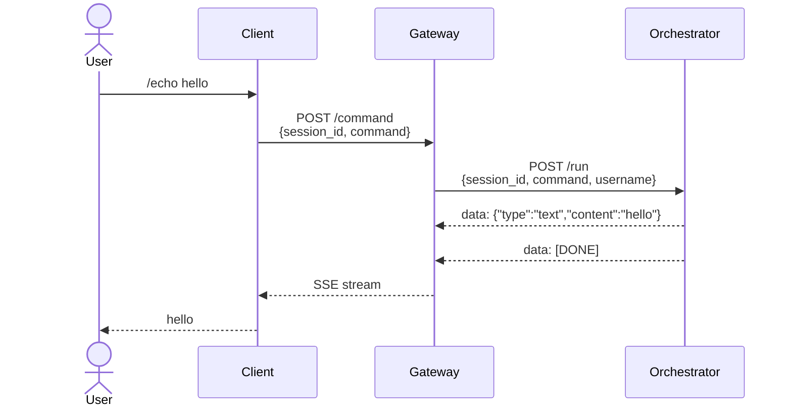
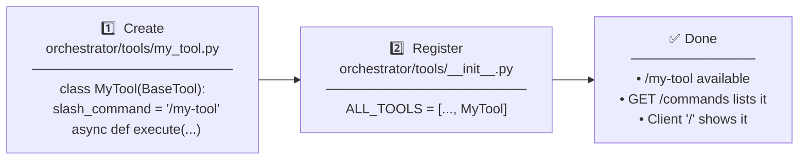

# maha-claude

A multi-layer automation system powered by Claude.

## Architecture

The system consists of three independent layers:

| Layer | Description | Reference |
|---|---|---|
| **Client** | Windows Terminal Client (Thin UI) | `skills/client/CLAUDE.md` |
| **Gateway** | FastAPI + Session Manager | `skills/gateway/CLAUDE.md` |
| **Orchestrator** | Agent Orchestrator | `skills/orchestrator/CLAUDE.md` |

## Workflow

### System Overview



### Command Flow



### Approval Flow


### Adding a New Slash Command



## Quick Start

```bash
# 1. Clone the repository
git clone <repo-url>
cd maha-claude

# 2. One-time setup (git hooks + dependencies)
bash setup.sh

# 3. Start Gateway (port 8000)
PYTHONPATH=gateway python3 gateway/main.py

# 4. Start Orchestrator (port 9000)
PYTHONPATH=orchestrator python3 orchestrator/main.py

# 5. Run the terminal client
GATEWAY_URL=http://localhost:8000 python3 client/main.py
```

## Client

The terminal client (`client/main.py`) connects to the Gateway and provides:

- Login / authentication (token stored in memory only)
- Session start / end
- `/COMMAND` slash command input with streaming response output
- Approval request handling
- `GET /commands` auto-discovery on session start

**Environment Variables:**

| Variable | Default | Description |
|---|---|---|
| `GATEWAY_URL` | `http://localhost:8000` | Gateway server address |
| `SESSION_TIMEOUT` | `3600` | Session timeout in seconds |

## Slash Commands

| Command | Description | Approval |
|---|---|---|
| `/echo <msg>` | Echo message back | - |
| `/help` | List available commands | - |
| `/status` | Show session info | - |
| `/run-tests [path]` | Run pytest | ✅ Required |

Type `/` alone to show the command list locally.

## Development

### Requirements

```bash
pip install -r client/requirements-dev.txt
pip install -r gateway/requirements.txt
pip install -r orchestrator/requirements.txt
```

### Running Tests

```bash
# All layers
pytest client/tests/ gateway/tests/ orchestrator/tests/ -v

# Per layer (with correct PYTHONPATH)
PYTHONPATH=client     pytest client/tests/
PYTHONPATH=gateway    pytest gateway/tests/
PYTHONPATH=orchestrator pytest orchestrator/tests/
```

### Commit Message Format (Linux Kernel Style)

```
subsystem: brief description (max 72 chars, no trailing period)

Optional body explaining what and why.
Lines wrapped at 72 characters.
```

Allowed subsystem prefixes: `client`, `gateway`, `orchestrator`, `ci`, `docs`, `test`, `build`

### Git Hooks

Activated automatically via `setup.sh`:

- **pre-commit**: Runs pytest per layer — commit blocked if any test fails
- **commit-msg**: Validates Linux kernel commit message format

## Changelog

See [NEWS](NEWS) for release notes.
