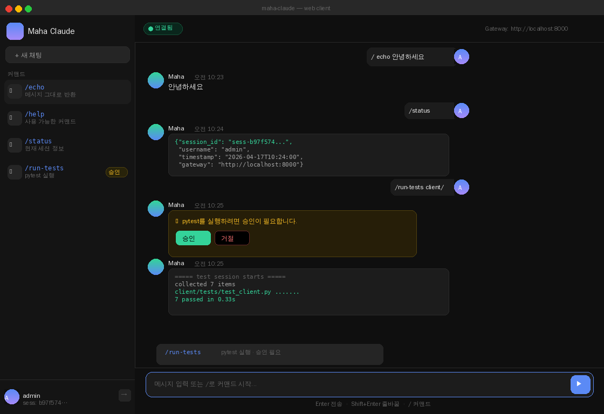
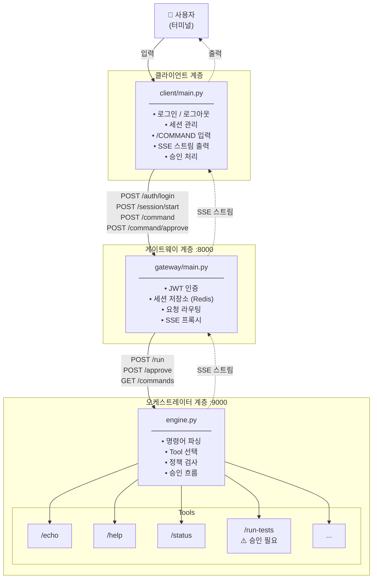
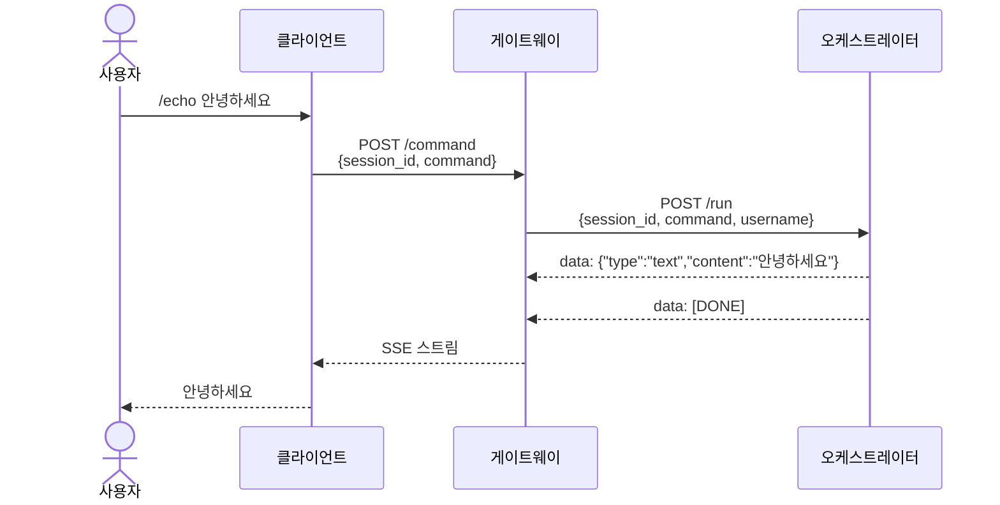
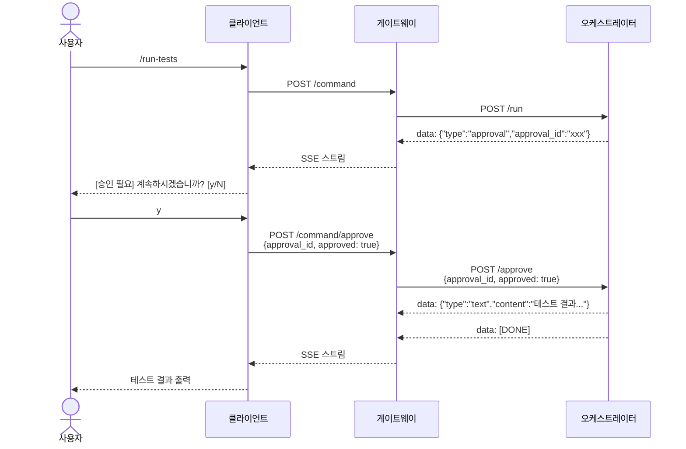
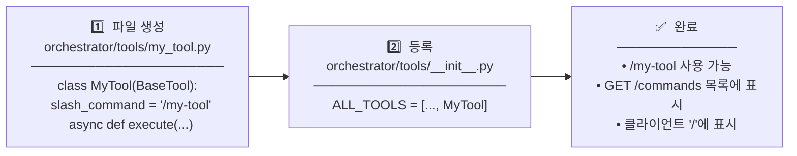

# maha-claude

Claude 기반 다계층 자동화 시스템

## 웹 클라이언트 UI



> `python3 client/web_main.py` → `http://localhost:3000`

## 아키텍처

시스템은 3개의 독립 계층으로 구성됩니다:

| 계층 | 설명 | 참조 문서 |
|---|---|---|
| **Client** | Windows 터미널 클라이언트 (UI 전용) | `client/CLAUDE.md` |
| **Gateway** | FastAPI + 세션 매니저 | `gateway/CLAUDE.md` |
| **Orchestrator** | 에이전트 실행 엔진 | `orchestrator/CLAUDE.md` |

## 워크플로우

### 시스템 전체 구조



### 명령어 실행 흐름



### 승인 흐름



### 새 슬래시 커맨드 추가 방법



## 빠른 시작

```bash
# 1. 저장소 클론
git clone <repo-url>
cd maha-claude

# 2. 최초 설정 (git hooks + 의존성 설치)
bash setup.sh

# 3. 게이트웨이 실행 (포트 8000)
PYTHONPATH=gateway python3 gateway/main.py

# 4. 오케스트레이터 실행 (포트 9000)
PYTHONPATH=orchestrator python3 orchestrator/main.py

# 5. 터미널 클라이언트 실행
GATEWAY_URL=http://localhost:8000 python3 client/main.py
```

## 클라이언트

터미널 클라이언트(`client/main.py`)는 게이트웨이에 연결하여 다음 기능을 제공합니다:

- 로그인 / 인증 (토큰은 메모리에만 저장)
- 세션 시작 / 종료
- `/COMMAND` 슬래시 커맨드 입력 및 SSE 스트리밍 출력
- 승인 요청 처리
- 세션 시작 시 `GET /commands`로 명령어 목록 자동 조회

**환경 변수:**

| 변수 | 기본값 | 설명 |
|---|---|---|
| `GATEWAY_URL` | `http://localhost:8000` | 게이트웨이 주소 |
| `SESSION_TIMEOUT` | `3600` | 세션 타임아웃 (초) |

## 슬래시 커맨드

| 커맨드 | 설명 | 승인 |
|---|---|---|
| `/echo <메시지>` | 메시지 그대로 반환 | - |
| `/help` | 사용 가능한 커맨드 목록 표시 | - |
| `/status` | 현재 세션 정보 표시 | - |
| `/run-tests [경로]` | pytest 실행 | ✅ 필요 |

`/` 단독 입력 시 로컬 캐시된 커맨드 목록을 표시합니다.

## 개발

### 의존성 설치

```bash
pip install -r client/requirements-dev.txt
pip install -r gateway/requirements.txt
pip install -r orchestrator/requirements.txt
```

### 테스트 실행

```bash
# 전체 계층
pytest client/tests/ gateway/tests/ orchestrator/tests/ -v

# 계층별 (PYTHONPATH 지정)
PYTHONPATH=client      pytest client/tests/
PYTHONPATH=gateway     pytest gateway/tests/
PYTHONPATH=orchestrator pytest orchestrator/tests/
```

### 커밋 메시지 규칙 (Linux Kernel 형식)

```
subsystem: 간략한 설명 (최대 72자, 마침표 없음)

변경 이유와 내용을 설명하는 본문 (선택)
각 줄 최대 72자
```

허용되는 subsystem 접두어: `client`, `gateway`, `orchestrator`, `ci`, `docs`, `test`, `build`

### Git Hooks

`setup.sh` 실행 시 자동 활성화:

- **pre-commit**: 계층별 pytest 실행 — 테스트 실패 시 커밋 차단
- **commit-msg**: Linux kernel 커밋 메시지 형식 검증

## 배포

systemd 유닛 파일은 `deploy/` 디렉토리에 있습니다:

| 파일 | 설명 |
|---|---|
| `deploy/maha-gateway.service` | 게이트웨이 서비스 (포트 8000) |
| `deploy/maha-orchestrator.service` | 오케스트레이터 서비스 (포트 9000) |

```bash
# 서비스 파일 설치
sudo cp deploy/maha-gateway.service /etc/systemd/system/
sudo cp deploy/maha-orchestrator.service /etc/systemd/system/
sudo systemctl daemon-reload
sudo systemctl enable maha-gateway maha-orchestrator
sudo systemctl start maha-gateway maha-orchestrator
```

## 변경 이력

[NEWS](NEWS) 파일을 참조하세요.
